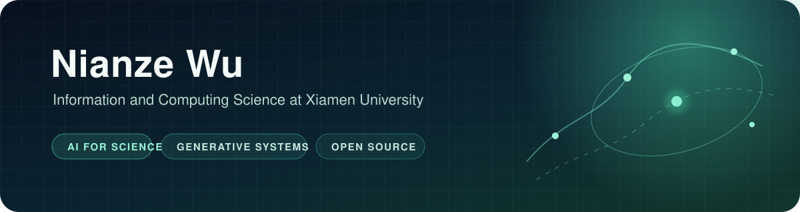

  

  Information and Computing Science undergraduate at Xiamen University. 
  I build reproducible AI systems and contribute tested fixes to open-source ML projects.

  <code>Python</code>&nbsp;&nbsp;
  <code>PyTorch</code>&nbsp;&nbsp;
  <code>C++</code>&nbsp;&nbsp;
  <code>TypeScript</code>&nbsp;&nbsp;
  <code>React</code>&nbsp;&nbsp;
  <code>Cloudflare</code>&nbsp;&nbsp;
  <code>Linux</code>

## Building

### [Xingma Qihang / 星码奇航](https://github.com/farlyfeifei/xingma-qihang)

An original browser-based Python learning platform for young learners. I worked on the cloud platform and deterministic verification path: D1-backed course and progress data, Auth0 integration, trusted checks for all 73 coding tasks, retryable cold starts, and public-demo reliability. AI assists the learning experience but never decides whether a submission passes.

[Live application](https://python.farly.me) | [My commits](https://github.com/farlyfeifei/xingma-qihang/commits/main/?author=wunianze666-netizen) | [Architecture and constraints](https://github.com/farlyfeifei/xingma-qihang#架构)

## Open-source engineering

- **[InvokeAI](https://github.com/invoke-ai/InvokeAI)** - hardened external image downloads and injected HTTP sessions against SSRF bypasses, including socket-level and adversarial regression coverage ([#9525](https://github.com/invoke-ai/InvokeAI/pull/9525), [#9524](https://github.com/invoke-ai/InvokeAI/pull/9524)).
- **[Hugging Face Diffusers](https://github.com/huggingface/diffusers)** - fixed required-input metadata generation for custom Mellon blocks and added a regression test ([#13888](https://github.com/huggingface/diffusers/pull/13888)).
- **[sktime](https://github.com/sktime/sktime)** - migrated the multithreading capability tag to the typed tag registry while preserving lookup behavior ([#10848](https://github.com/sktime/sktime/pull/10848)).
- **[Soda Core](https://github.com/sodadata/soda-core)** - prevented SQL Server connection parameter values from leaking into logs and added security regression coverage ([#2762](https://github.com/sodadata/soda-core/pull/2762)).

## Current direction

I am exploring physics-aware generative modeling and optimization for AI4S, alongside reliability and security in generative AI infrastructure. I care about work that can be reproduced, tested under failure, and explained from design decision to observable result.

Open to thoughtful collaboration around AI4S, generative systems, and reliable ML infrastructure.
