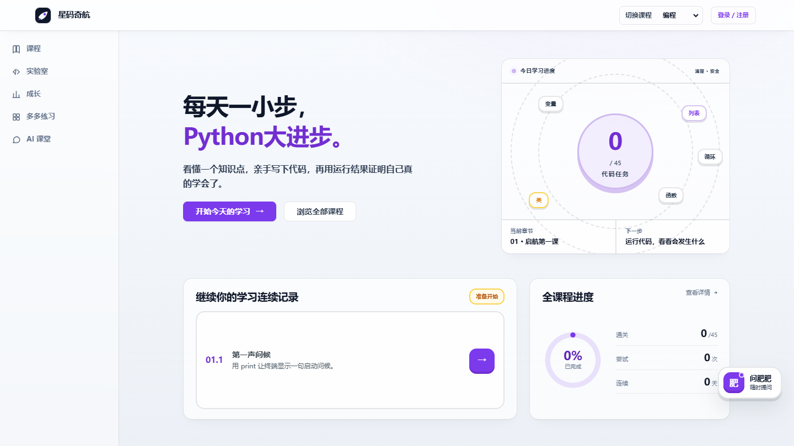

  <picture>
    <source media="(max-width: 600px)" srcset="./assets/profile-header-mobile.svg" />
    
  </picture>

  I study Information and Computing Science at Xiamen University. 
  My interests sit where mathematical modeling, generative AI, and dependable software meet.

  <a href="#selected-work">Selected work</a>&nbsp;&nbsp;/&nbsp;&nbsp;
  <a href="#selected-upstream-work">Open source</a>&nbsp;&nbsp;/&nbsp;&nbsp;
  <a href="#now">Current focus</a>&nbsp;&nbsp;/&nbsp;&nbsp;
  <a href="#beyond-the-model">Beyond the model</a>

  <picture>
    <source media="(prefers-color-scheme: dark)" srcset="https://skillicons.dev/icons?i=python%2Cpytorch%2Ccpp%2Cts%2Creact%2Ccloudflare&amp;theme=dark&amp;perline=6" />
    
  </picture>

<table>
  <tr>
    <td width="50%" valign="top"><strong>AI for Science</strong> Physics-aware generation, mathematical modeling, and optimization.</td>
    <td width="50%" valign="top"><strong>Reliable AI systems</strong> Reproducibility, validation, failure handling, and security boundaries.</td>
  </tr>
  <tr>
    <td width="50%" valign="top"><strong>Product engineering</strong> Browser experiences, typed frontends, APIs, and cloud data paths.</td>
    <td width="50%" valign="top"><strong>Open-source quality</strong> Focused fixes, regression tests, and reviewable design decisions.</td>
  </tr>
</table>

## Selected work

### [Xingma Qihang / 星码奇航](https://python.farly.me)

<table>
  <tr>
    <td width="66%" valign="top"><strong>What it is</strong> An original browser-based Python learning platform for young learners, built around short lessons, real code execution, and observable progress.</td>
    <td width="34%" valign="top"><strong>My focus</strong> Cloud platform, deterministic verification, identity, data consistency, and public-demo reliability.</td>
  </tr>
</table>

I worked on D1-backed course and progress data, Auth0 integration, trusted checks for published coding tasks, retryable cold starts, and failure-safe navigation. AI assists the learning experience but never decides whether a submission passes.

[Explore the public application](https://python.farly.me)

  
<strong>Engineering notes</strong>

   

- Kept pass/fail decisions in bounded deterministic verifiers while leaving AI in an explanatory role.
- Versioned course content and progress events so published updates do not silently invalidate learner state.
- Treated cold starts, seed retries, primary-read consistency, and unavailable verifiers as explicit failure paths.

## Selected upstream work

<table>
  <tr>
    <td valign="top"><strong><a href="https://github.com/invoke-ai/InvokeAI">InvokeAI</a></strong>&nbsp; SECURITY / PYTHON Closed two SSRF paths in external image downloads and injected HTTP sessions, backed by adversarial socket-level tests (<a href="https://github.com/invoke-ai/InvokeAI/pull/9525">#9525</a>, <a href="https://github.com/invoke-ai/InvokeAI/pull/9524">#9524</a>).</td>
  </tr>
  <tr>
    <td valign="top"><strong><a href="https://github.com/huggingface/diffusers">Diffusers</a></strong>&nbsp; GENERATIVE AI / PYTHON Corrected required-input metadata for custom Mellon pipeline blocks and added focused regression coverage (<a href="https://github.com/huggingface/diffusers/pull/13888">#13888</a>).</td>
  </tr>
  <tr>
    <td valign="top"><strong><a href="https://github.com/sktime/sktime">sktime</a></strong>&nbsp; ML INFRA / TYPING Migrated the multithreading capability to the typed tag registry while preserving lookup behavior (<a href="https://github.com/sktime/sktime/pull/10848">#10848</a>).</td>
  </tr>
  <tr>
    <td valign="top"><strong><a href="https://github.com/sodadata/soda-core">Soda Core</a></strong>&nbsp; DATA / PRIVACY Prevented SQL Server connection parameter values from leaking into logs (<a href="https://github.com/sodadata/soda-core/pull/2762">#2762</a>).</td>
  </tr>
  <tr>
    <td valign="top"><strong><a href="https://github.com/freeCodeCamp/freeCodeCamp">freeCodeCamp</a></strong>&nbsp; AST / JAVASCRIPT Replaced syntax-specific validation with AST inspection so declarations, expressions, and arrow functions follow the same curriculum rule (<a href="https://github.com/freeCodeCamp/freeCodeCamp/pull/69520">#69520</a>).</td>
  </tr>
</table>

## Now

I am exploring physics-aware generative modeling and optimization for AI4S, alongside reliability and security in generative AI infrastructure. I prefer work that can be reproduced, tested under failure, and explained from a design decision to an observable result.

## Beyond the model

I also care about visual explanation, clean interfaces, and concise technical writing. Research is easier to trust when another person can understand the assumptions, run the code, and see how it fails.

Open to thoughtful collaboration around AI4S, generative systems, and reliable ML infrastructure.
